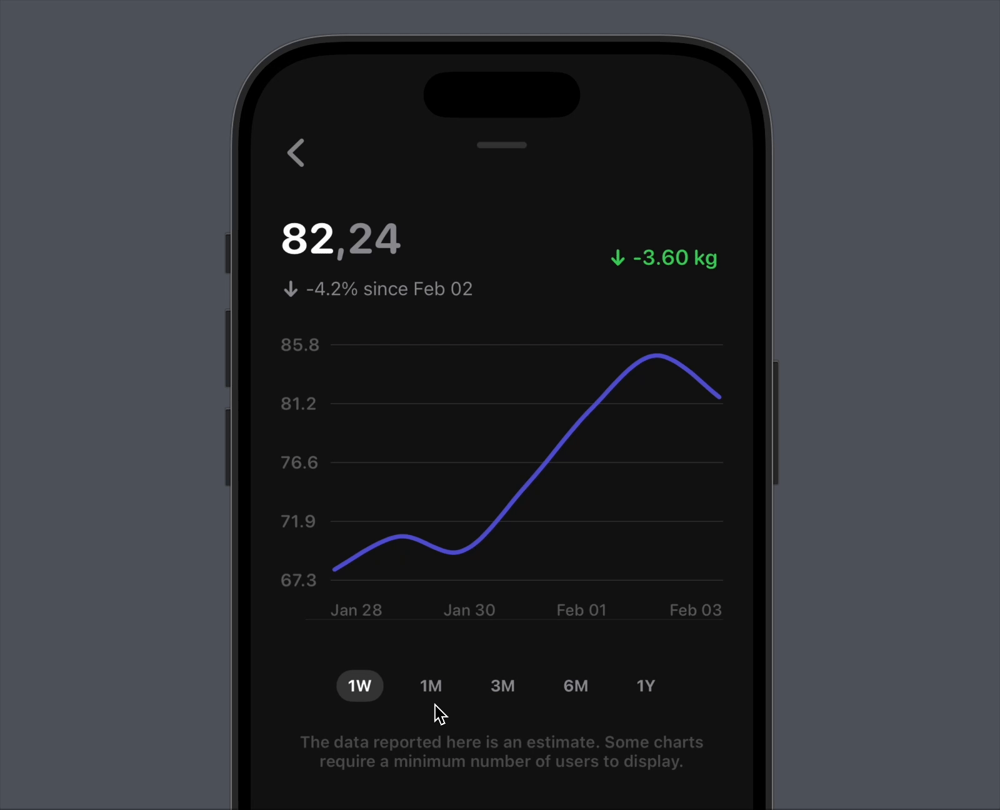

# Animated Line Chart Demo

<div align="center">
  
  
  
  <br><br>
  
  
  
  <p>High-performance line chart built purely with Core Animation</p>
</div>

## Key Features
✨ **Zero External Dependencies**
- Built entirely with native iOS frameworks
- Pure Core Animation and Core Graphics implementation
- No third-party charting libraries
- Lightweight and efficient

🚀 **Performance**
- Hardware-accelerated animations
- Efficient layer-based rendering
- Smooth 60 FPS animations
- Optimized for battery life

## Usage

### Basic Setup
```swift
// Create configuration
var configuration = LineChartAppearanceConfiguration()
configuration.showsVerticalGridLines = false
configuration.dateFormatter.dateFormat = "HH:mm"
configuration.padding.right = 0

// Initialize chart view
let chartView = LineChartView(configuration: configuration) { point in
    // Customize point label format
    return "\(point.timestamp), \(String(format: "%.1f", point.value))"
}
```

## Requirements
- iOS 14.0+
- Swift 5.5+
- Xcode 13.0+

## Author
Created by [Vlad Tretiak](https://www.linkedin.com/in/vlad-tretyak/)

## License
MIT License - feel free to use in your projects 😉
